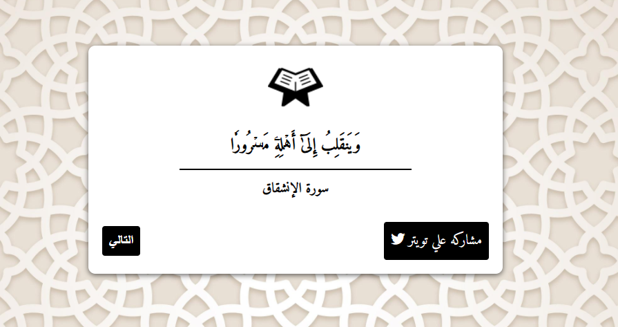

# Ayat Al-Quran (آيات القرآن)

<p align='center'>
  
</p>

A small web app that shows a random verse (آية) from the Holy Quran together with its surah name. Click **التالي** (Next) to get another verse, or share the current one on Twitter.

**Live demo:** https://ayat-alquran.vercel.app

## Features
- Picks a random surah (1–114) and a random verse from it
- Arabic, right-to-left interface using the Amiri font
- One-click sharing of the current verse to Twitter
- Shows a friendly message if the verse data can't be loaded

## Data source
Verses come from the [`quran-json`](https://www.npmjs.com/package/quran-json) package (v3.1.2), served by the jsDelivr CDN:
`https://cdn.jsdelivr.net/npm/quran-json@3.1.2/dist/chapters/<1-114>.json`

## Tools used
- HTML
- CSS
- JavaScript (Fetch API)

## Run locally
No build step or dependencies are needed. Clone the repo and open `index.html` in a browser, or serve the folder with any static server, for example:

```bash
npx serve .
# or
python3 -m http.server 8000
```
